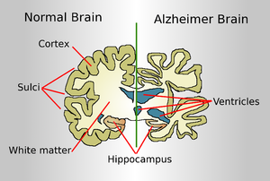

# predicting alzheimer's disease 

## Origin and description of data
### Origin
The data used for this project is the version 2 of <a href='http://www.oasis-brains.org/'>Open Access Series of Imaging Studies (OASIS)</a> project which aims to make neuroimaging data sets of the brain available to the scientific community free of charge thanks to their desire of facilitate future discoveries in basic and clinical neurosscience.

### Description
The data set consists of a longitudinal collection of 150(88 women) subjects aged 60 to 98. Each subject was scanned on 2 to 5 visits, separated by at least one year for a total of 373 imaging sessions. For each subject, 3 or 4 individual T1-weighted MRI scans obtained in single scan sessions are included. The subjects are all right-handed and include both men and women. 72 of the subjects were characterized as nondemented throughout the study. 64 of the included subjects were characterized as demented at the time of their initial visits and remained so for subsequent scans, including 51 individuals with mild to moderate Alzheimer’s disease. Another 14 subjects were characterized as nondemented at the time of their initial visit and were subsequently characterized as demented at a later visit, their mental health status is labelled as converted.

The dataset is organized in 15 columns named as follows:
- ID : Patient unique identification number.
- MRI ID: Unique MRI ID per visit
- Group : Mental health status of the patient (Demented, Nondemented or Converted)
- Visit : Visit number (1 to 5)
- MR Delay: Time (in days) since the last visit
- Sex : Gender (M or F)
- Hand : Dominat hand (all R)
- Age : Age at time of image acquisition (years) 
- EDUC : Years of education
- SES : SoxioEconomic Status
- MMSE : Mini Mental State Examination  (0 = worst to 30 = best)
- CDR : Clinical Dementia Rating (0 = no dementia, 0.5 = very mild AD, 1 = mild AD, 2 = moderate AD)
- ETIV : Estimated Total Intracranial Volume ($cm^3$ )
- NWBV : Normalize Whole Brain Volume
- ASF : Atlas Scaling Factor

These characteristics belong to two different obvious clusters: Patients' personal information (Age, Dominant hand, gender...) and their medical measurements (CDR, ASF...).

An exploratory data analysis will helps us to better understand the data an eventually answer the following questions:
1. How does the risk of contracting Alzheimer's disease evolve with age?
2. Which medical factors should be closely monitored in order to prevent Alzheimer's disease?
4. How accurately can we predict Alzheimer's disease?
